# Sistema de Tarifas Jerárquicas - Guía Completa

## 📋 Índice

1. [Filosofía Central](#filosofía-central)
2. [Arquitectura del Sistema](#arquitectura-del-sistema)
3. [API Endpoints](#api-endpoints)
4. [Ejemplos de Uso](#ejemplos-de-uso)
5. [Flujos de Trabajo](#flujos-de-trabajo)
6. [Casos de Uso Reales](#casos-de-uso-reales)

---

## Filosofía Central

### "Plantillas Maestras" con Anulación Selectiva

El sistema de tarifas jerárquicas resuelve dos problemas clave:

1. **¿Cómo establece el Forwarder un precio base?**

   -  El Forwarder crea "tarifas maestras" (`is_base_rate = true`)
   -  Estas actúan como plantillas para toda la jerarquía

2. **¿Cómo establece cada agencia su margen de ganancia?**
   -  Por defecto, las agencias **heredan** las tarifas de su padre
   -  Solo crean registros en la BD cuando quieren **personalizar/anular** una tarifa
   -  Esto mantiene la base de datos eficiente y auditable

### Principio de Cascada de Precios

```
rate_in_cents (Padre) → cost_in_cents (Hijo)
```

El precio de venta de un nivel se convierte en el costo del siguiente nivel.

**Ejemplo:**

-  Forwarder: cost=$8.00, rate=$10.00 → Vende a agencia por $10.00
-  Agencia A: cost=$10.00, rate=$15.00 → Vende por $15.00 (margen $5.00)
-  Agencia B: cost=$15.00, rate=$18.00 → Vende por $18.00 (margen $3.00)

---

## Arquitectura del Sistema

### Los 3 Pilares

#### 1. Modelo de Herencia (Estructura de Datos)

**Campos Clave en `ShippingRate`:**

```typescript
{
   id: number; // ID único de la tarifa
   parent_rate_id: number | null; // Apunta a la tarifa padre (null para base rates)
   agency_id: number | null; // null para base rates, ID de agencia para custom rates
   forwarder_id: number; // Siempre presente, identifica al forwarder dueño

   cost_in_cents: number; // Costo de adquisición (rate_in_cents del padre)
   rate_in_cents: number; // Precio de venta al siguiente nivel

   is_base_rate: boolean; // true solo para tarifas maestras del Forwarder
   is_active: boolean; // Para soft deletes

   rate_type: RateType; // WEIGHT | FIXED
   min_weight: number | null; // Para tarifas por peso
   max_weight: number | null; // Para tarifas por peso
}
```

#### 2. Algoritmo Resolver (El Núcleo)

El **resolver** encuentra la tarifa efectiva para una agencia subiendo por la jerarquía:

```typescript
// Pseudocódigo del algoritmo
function resolveEffectiveRate(agency_id, service_id, weight?) {
   // 1. Buscar tarifa personalizada de la agencia
   const customRate = findCustomRate(agency_id, service_id, weight);

   if (customRate) {
      return { rate: customRate, is_inherited: false };
   }

   // 2. Si no existe, subir al padre
   const parentAgency = getParentAgency(agency_id);

   if (parentAgency) {
      const parentRate = resolveEffectiveRate(parentAgency.id, service_id, weight);
      return { ...parentRate, is_inherited: true };
   }

   // 3. Si no hay padre, buscar tarifa base del Forwarder
   const baseRate = findBaseRate(forwarder_id, service_id, weight);

   return { rate: baseRate, is_inherited: true };
}
```

#### 3. Flujo de Trabajo

**A. Creación de Tarifas Base (Solo Forwarder)**

```http
POST /shipping-rates/base-rate
{
  "name": "Caja Mediana",
  "service_id": 1,
  "cost_in_cents": 800,
  "rate_in_cents": 1000,
  "rate_type": "WEIGHT",
  "min_weight": 5,
  "max_weight": 10
}
```

**B. Personalización Individual**

```http
POST /shipping-rates/custom-rate
{
  "parent_rate_id": 101,
  "agency_id": 5,
  "rate_in_cents": 1500,
  "description": "Caja Mediana con margen 50%"
}
```

**C. Personalización en Lote**

```http
POST /shipping-rates/bulk-customize
{
  "agency_id": 5,
  "service_id": 1,
  "margin_percentage": 15
}
```

---

## API Endpoints

### 1. Resolver Tarifas Efectivas (Core)

```http
GET /shipping-rates/resolve/:agency_id/:service_id?weight=7.5&rate_type=WEIGHT
```

**Respuesta:**

```json
{
   "agency_id": 5,
   "service_id": 1,
   "rates": [
      {
         "rate": {
            "id": 202,
            "name": "Caja Mediana",
            "cost_in_cents": 1000,
            "rate_in_cents": 1500,
            "rate_type": "WEIGHT",
            "min_weight": 5,
            "max_weight": 10
         },
         "is_inherited": false,
         "source_agency_id": 5,
         "margin_in_cents": 500
      }
   ]
}
```

### 2. Crear Tarifa Base (Forwarder)

```http
POST /shipping-rates/base-rate
Authorization: Bearer <token>
```

**Body:**

```json
{
   "name": "Envío Estándar 0-5 lbs",
   "description": "Tarifa base para paquetes pequeños",
   "service_id": 1,
   "cost_in_cents": 500,
   "rate_in_cents": 800,
   "rate_type": "WEIGHT",
   "min_weight": 0,
   "max_weight": 5
}
```

### 3. Crear Tarifa Personalizada (Agencia)

```http
POST /shipping-rates/custom-rate
Authorization: Bearer <token>
```

**Body:**

```json
{
   "parent_rate_id": 101,
   "agency_id": 5,
   "rate_in_cents": 1200,
   "description": "Precio ajustado para región metropolitana"
}
```

**Validaciones Automáticas:**

-  ✅ `rate_in_cents` debe ser > `parent.rate_in_cents`
-  ✅ `cost_in_cents` se establece automáticamente = `parent.rate_in_cents`
-  ✅ Se hereda `rate_type`, `min_weight`, `max_weight` del padre

### 4. Personalización en Lote

```http
POST /shipping-rates/bulk-customize
Authorization: Bearer <token>
```

**Body:**

```json
{
   "agency_id": 5,
   "service_id": 1,
   "margin_percentage": 20
}
```

**Resultado:**

-  Busca todas las tarifas del servicio (heredadas o base)
-  Crea/actualiza tarifas personalizadas con 20% de margen
-  Transacción atómica (todo o nada)

### 5. Ver Tarifas Disponibles

```http
GET /shipping-rates/available/:agency_id/:service_id
```

**Respuesta:**

```json
{
  "agency_id": 5,
  "service_id": 1,
  "rates": [
    {
      "rate": {...},
      "is_inherited": true,
      "source_agency_id": 3,
      "margin_in_cents": 200
    }
  ]
}
```

### 6. Ver Jerarquía (Auditoría)

```http
GET /shipping-rates/hierarchy/:rate_id
```

**Respuesta:**

```json
{
   "rate": {
      "id": 202,
      "name": "Caja Mediana",
      "cost_in_cents": 1000,
      "rate_in_cents": 1500,
      "margin_in_cents": 500,
      "is_base_rate": false,
      "agency": {
         "id": 5,
         "name": "Agencia Miami"
      }
   },
   "parent": {
      "id": 101,
      "cost_in_cents": 800,
      "rate_in_cents": 1000
   },
   "children": [
      {
         "id": 303,
         "cost_in_cents": 1500,
         "rate_in_cents": 1800,
         "margin_in_cents": 300,
         "agency": {
            "id": 8,
            "name": "Sub-agencia Coral Gables"
         }
      }
   ]
}
```

### 7. Actualizar Tarifa Personalizada

```http
PUT /shipping-rates/update-custom/:rate_id
Authorization: Bearer <token>
```

**Body:**

```json
{
   "rate_in_cents": 1600,
   "description": "Precio ajustado Q4 2025"
}
```

### 8. Actualizar Tarifa Base con Cascada

```http
PUT /shipping-rates/update-base-rate/:rate_id
Authorization: Bearer <token>
```

**Body:**

```json
{
   "rate_in_cents": 900,
   "cascade_to_children": true
}
```

**Comportamiento:**

-  Si `cascade_to_children = true`:
   -  Actualiza todas las tarifas hijas con `cost_in_cents = 900`
   -  Mantiene los `rate_in_cents` personalizados de cada hijo
-  Si `cascade_to_children = false`:
   -  Solo actualiza la tarifa base

### 9. Desactivar Tarifa

```http
PUT /shipping-rates/deactivate/:rate_id
Authorization: Bearer <token>
```

**Comportamiento:**

-  Soft delete (`is_active = false`)
-  Desactiva automáticamente todas las tarifas hijas
-  Retorna el conteo de tarifas desactivadas

---

## Ejemplos de Uso

### Ejemplo 1: Configuración Inicial (Forwarder)

```bash
# 1. Forwarder crea tarifas base
curl -X POST http://api.ctenvios.com/shipping-rates/base-rate \
  -H "Authorization: Bearer <forwarder_token>" \
  -H "Content-Type: application/json" \
  -d '{
    "name": "0-5 lbs",
    "service_id": 1,
    "cost_in_cents": 500,
    "rate_in_cents": 800,
    "rate_type": "WEIGHT",
    "min_weight": 0,
    "max_weight": 5
  }'

# 2. Crear más rangos
curl -X POST http://api.ctenvios.com/shipping-rates/base-rate \
  -H "Authorization: Bearer <forwarder_token>" \
  -H "Content-Type: application/json" \
  -d '{
    "name": "5-10 lbs",
    "service_id": 1,
    "cost_in_cents": 800,
    "rate_in_cents": 1200,
    "rate_type": "WEIGHT",
    "min_weight": 5,
    "max_weight": 10
  }'
```

### Ejemplo 2: Agencia Personaliza Tarifas

```bash
# Agencia ID 5 quiere un margen del 25% en todas las tarifas del servicio 1
curl -X POST http://api.ctenvios.com/shipping-rates/bulk-customize \
  -H "Authorization: Bearer <agency_token>" \
  -H "Content-Type: application/json" \
  -d '{
    "agency_id": 5,
    "service_id": 1,
    "margin_percentage": 25
  }'

# Resultado automático:
# - Tarifa 0-5 lbs: cost=$8.00, rate=$10.00 (25% sobre $8.00)
# - Tarifa 5-10 lbs: cost=$12.00, rate=$15.00 (25% sobre $12.00)
```

### Ejemplo 3: Resolver Tarifa para Facturación

```javascript
// En tu controlador de órdenes/facturas
import services from "../services";

async function calculateShippingCost(order) {
   const { agency_id, service_id, weight } = order;

   // Resolver tarifa efectiva usando el algoritmo jerárquico
   const rateResults = await services.shippingRates.resolveEffectiveRate(agency_id, service_id, weight, "WEIGHT");

   // Tomar la primera tarifa que coincida con el peso
   const effectiveRate = rateResults[0];

   console.log(`
    Tarifa aplicada: ${effectiveRate.rate.name}
    Precio: $${effectiveRate.rate.rate_in_cents / 100}
    Costo: $${effectiveRate.rate.cost_in_cents / 100}
    Margen: $${effectiveRate.margin_in_cents / 100}
    Heredada: ${effectiveRate.is_inherited}
  `);

   return effectiveRate.rate.rate_in_cents;
}
```

### Ejemplo 4: Sub-agencia Hereda sin Personalizar

```bash
# Agencia 8 es hija de Agencia 5
# No ha creado tarifas personalizadas

curl -X GET http://api.ctenvios.com/shipping-rates/resolve/8/1?weight=7

# Respuesta:
{
  "agency_id": 8,
  "service_id": 1,
  "rates": [
    {
      "rate": {
        "id": 202,
        "cost_in_cents": 1200,
        "rate_in_cents": 1500
      },
      "is_inherited": true,  # ← Heredada del padre (Agencia 5)
      "source_agency_id": 5
    }
  ]
}

# La Agencia 8 vende por $15.00 automáticamente
# Si su padre (Agencia 5) actualiza la tarifa a $16.00,
# la Agencia 8 también venderá por $16.00 automáticamente
```

---

## Flujos de Trabajo

### Flujo 1: Nueva Agencia se Activa


### Flujo 2: Actualización de Precio Base

```mermaid
graph TD
    A[Forwarder actualiza precio base] --> B{cascade_to_children?}
    B -->|true| C[Actualizar cost_in_cents de hijos]
    B -->|false| D[Solo actualizar base rate]
    C --> E[Hijos mantienen sus márgenes]
    E --> F[Sistema recalcula automáticamente]
```



### Flujo 3: Facturación/Cotización

```mermaid
graph TD
    A[Cliente solicita envío] --> B[Obtener agency_id, service_id, weight]
    B --> C[Llamar resolveEffectiveRate]
    C --> D{¿Tiene tarifa personalizada?}
    D -->|Sí| E[Usar tarifa personalizada]
    D -->|No| F[Subir al padre]
    F --> G{¿Padre tiene tarifa?}
    G -->|Sí| E
    G -->|No| H[Subir hasta base rate]
    H --> E
    E --> I[Aplicar precio a factura]
```



---

## Casos de Uso Reales

### Caso 1: Forwarder con 3 Niveles de Agencias

**Estructura:**

```
Forwarder CTEnvios (id: 1)
├── Agencia Miami (id: 5)
│   ├── Sub-agencia Coral Gables (id: 8)
│   └── Sub-agencia Doral (id: 9)
└── Agencia New York (id: 6)
```

**Configuración de Tarifas:**

1. **Forwarder crea base rate:**

   ```json
   {
      "id": 101,
      "cost_in_cents": 500,
      "rate_in_cents": 800,
      "is_base_rate": true
   }
   ```

2. **Agencia Miami personaliza (+25%):**

   ```json
   {
      "id": 201,
      "parent_rate_id": 101,
      "agency_id": 5,
      "cost_in_cents": 800,
      "rate_in_cents": 1000
   }
   ```

3. **Sub-agencia Coral Gables NO personaliza:**

   -  Hereda automáticamente la tarifa de Miami
   -  Vende por $10.00

4. **Sub-agencia Doral personaliza (+10%):**
   ```json
   {
      "id": 301,
      "parent_rate_id": 201,
      "agency_id": 9,
      "cost_in_cents": 1000,
      "rate_in_cents": 1100
   }
   ```

**Resultado de Resolución:**

```bash
# Coral Gables (hereda de Miami)
GET /shipping-rates/resolve/8/1
→ rate_in_cents: 1000, is_inherited: true

# Doral (tiene personalización)
GET /shipping-rates/resolve/9/1
→ rate_in_cents: 1100, is_inherited: false

# New York (hereda de Forwarder)
GET /shipping-rates/resolve/6/1
→ rate_in_cents: 800, is_inherited: true
```

### Caso 2: Ajuste de Precios por Temporada

**Escenario:** El Forwarder aumenta precios en temporada alta.

```bash
# Forwarder actualiza base rate de $8.00 a $10.00
PUT /shipping-rates/update-base-rate/101
{
  "rate_in_cents": 1000,
  "cascade_to_children": true
}

# Efecto en cascada:
# - Miami: cost: $8→$10, rate: $10→$12.50 (mantiene margen 25%)
# - Coral Gables: automáticamente vende por $12.50 (heredado)
# - Doral: cost: $10→$12.50, rate: $11→$13.75 (mantiene margen 10%)
```

### Caso 3: Promoción Regional

**Escenario:** Miami quiere hacer una promoción reduciendo margen al 10%.

```bash
# Miami actualiza su tarifa personalizada
PUT /shipping-rates/update-custom/201
{
  "rate_in_cents": 880,
  "description": "Promoción Black Friday - Margen reducido"
}

# Efecto:
# - Miami ahora vende por $8.80 (cost: $8.00, margen: $0.80)
# - Coral Gables automáticamente vende por $8.80 (hereda)
# - Doral mantiene su margen sobre el nuevo precio: cost: $8.80, rate: $9.68
```

---

## Mejores Prácticas

### ✅ DO:

1. **Usar el resolver siempre en facturación**

   ```javascript
   const rates = await services.shippingRates.resolveEffectiveRate(...)
   ```

2. **Personalizar solo cuando sea necesario**

   -  Mayoría de agencias pueden heredar
   -  Personalizar solo si requieren márgenes diferentes

3. **Usar bulk-customize para configuración inicial**

   -  Más rápido que crear una por una
   -  Garantiza consistencia

4. **Auditar con hierarchy endpoint**
   ```bash
   GET /shipping-rates/hierarchy/:rate_id
   ```

### ❌ DON'T:

1. **No crear tarifas para todas las agencias por defecto**

   -  Desperdicia espacio en BD
   -  La herencia es automática

2. **No saltarse el resolver en facturación**

   -  Usar queries directas rompe la cadena de herencia

3. **No actualizar cost_in_cents manualmente en tarifas hijas**
   -  Usar `cascade_to_children` en base rate

---

## Integración con Sistema de Facturación

### Actualizar `resolveItemsWithHbl` (resolvers.service.ts)

```typescript
// En lugar de buscar tarifas directamente, usar el resolver
const effectiveRates = await services.shippingRates.resolveEffectiveRate(agency_id, service_id, item.weight);

// Usar la primera tarifa que coincida
const rate = effectiveRates[0]?.rate;

if (!rate) {
   throw new AppError(`No rate found for weight ${item.weight}`, 404);
}

// Usar el rate.rate_in_cents como precio de venta
// Usar el rate.cost_in_cents como costo base
```

---

## Convenciones Aplicadas

Este sistema sigue las convenciones del proyecto CTEnvios:

-  ✅ **TypeScript strict typing**: Interfaces explícitas para todas las entradas
-  ✅ **Repository pattern**: Separación de lógica de negocio y acceso a datos
-  ✅ **Functional programming**: Funciones puras, sin clases
-  ✅ **RESTful API design**: Endpoints semánticos y consistentes
-  ✅ **Transacciones**: Operaciones atómicas con Prisma
-  ✅ **Error handling**: AppError con mensajes descriptivos
-  ✅ **Explicit return types**: Todas las funciones tipadas

---

## Próximos Pasos

1. **Integrar con sistema de facturación existente**

   -  Actualizar `resolveItemsWithHbl` para usar el resolver
   -  Migrar endpoints antiguos al nuevo sistema

2. **Agregar CustomsRates hierarchy**

   -  El mismo patrón para tarifas aduanales
   -  Reutilizar lógica del resolver

3. **Dashboard de visualización**

   -  Vista de árbol de tarifas
   -  Simulador de márgenes

4. **Reportes y analytics**
   -  Márgenes por agencia
   -  Comparación de tarifas efectivas

---

## Soporte

Para preguntas o issues:

-  Ver código en: `src/services/shipping.rates.service.ts`
-  Ver rutas en: `src/routes/shipping-rates.routes.ts`
-  Ver schema en: `prisma/schema.prisma` (modelo `ShippingRate`)
