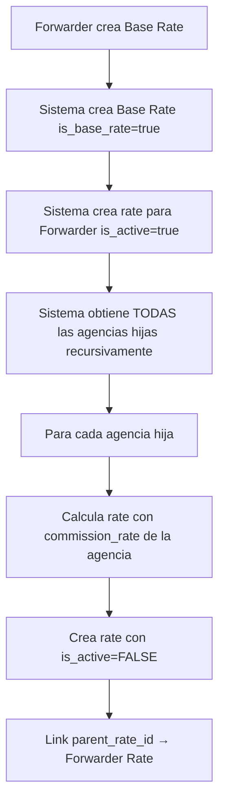
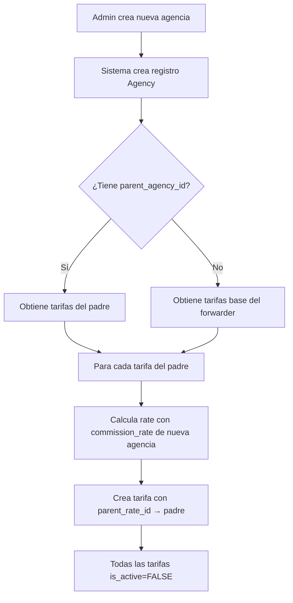
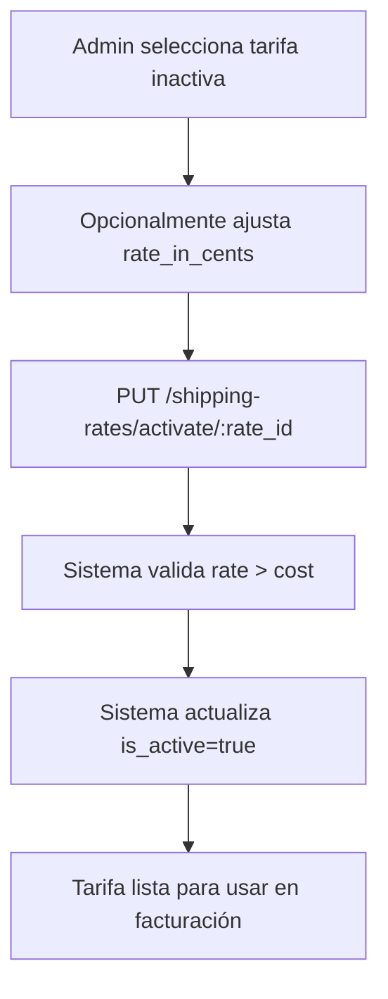
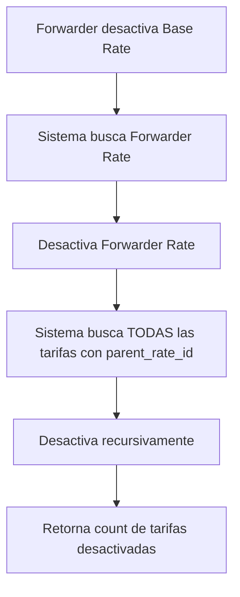

# Sistema de Distribución Masiva de Tarifas

## 📋 Filosofía del Sistema

Este sistema implementa un modelo de **distribución masiva con activación selectiva**:

1. ✅ **Tarifas Base** → Plantillas maestras creadas por el Forwarder
2. ✅ **Distribución Automática** → Todas las agencias reciben copias de las tarifas (inactivas por defecto)
3. ✅ **Activación Selectiva** → Administradores activan y configuran tarifas por agencia
4. ✅ **Herencia al Crear Agencia** → Nuevas agencias heredan tarifas de su padre automáticamente
5. ✅ **Desactivación en Cascada** → Desactivar tarifa base desactiva todas las tarifas hijas

---

## 🔄 Flujos del Sistema

### Flujo 1: Crear Tarifa Base (Forwarder)



**Endpoint:**

```bash
POST /shipping-rates/base-rate
Authorization: Bearer <FORWARDER_TOKEN>
Content-Type: application/json

{
  "name": "Envío 0-5 lbs",
  "description": "Tarifa base para paquetes pequeños",
  "service_id": 1,
  "cost_in_cents": 800,      # Lo que le cuesta al forwarder
  "rate_in_cents": 1000,     # Lo que cobra a sus agencias
  "rate_type": "WEIGHT",
  "min_weight": 0,
  "max_weight": 5
}
```

**Resultado:**

```json
{
   "message": "Base rate created and distributed to all agencies (inactive by default)",
   "base_rate": {
      "id": 101,
      "is_base_rate": true,
      "agency_id": null
   },
   "forwarder_rate": {
      "id": 102,
      "agency_id": 5,
      "is_active": true
   },
   "child_rates_created": 15, // Todas con is_active: false
   "explanation": {
      "distribution": "All child agencies received this rate as INACTIVE",
      "activation": "Use PUT /shipping-rates/activate/:rate_id to activate for specific agencies"
   }
}
```

**Base de Datos después:**

```sql
-- Base Rate (template)
id: 101, agency_id: NULL, is_base_rate: true, is_active: true, cost: $8, rate: $10

-- Forwarder Rate (active)
id: 102, agency_id: 5, is_base_rate: false, parent_rate_id: 101, is_active: true, cost: $8, rate: $10

-- Child Rates (inactive, waiting activation)
id: 103, agency_id: 10, parent_rate_id: 102, is_active: false, cost: $10, rate: $12  (20% commission)
id: 104, agency_id: 11, parent_rate_id: 102, is_active: false, cost: $10, rate: $13  (30% commission)
id: 105, agency_id: 12, parent_rate_id: 102, is_active: false, cost: $10, rate: $11  (10% commission)
```

---

### Flujo 2: Crear Nueva Agencia



**Endpoint:**

```bash
POST /agencies
Authorization: Bearer <FORWARDER_TOKEN>
Content-Type: application/json

{
  "agency": {
    "name": "Agencia Nueva Miami",
    "parent_agency_id": 10,
    "commission_rate": 15,
    ...
  },
  "user": {
    "name": "Admin Usuario",
    "email": "admin@nuevaagencia.com",
    "password": "secure123",
    "role": "AGENCY_ADMIN"
  }
}
```

**Resultado:**

```json
{
   "agency": { "id": 20, "name": "Agencia Nueva Miami" },
   "rates_created": 8,
   "message": "Agency created successfully with inherited rates (inactive by default)"
}
```

**¿Qué pasa con las tarifas?**

Si la agencia padre (id: 10) tiene estas tarifas:

```sql
id: 103, agency_id: 10, rate_in_cents: 1200, cost_in_cents: 1000
id: 150, agency_id: 10, rate_in_cents: 1800, cost_in_cents: 1500
```

La nueva agencia (id: 20) recibe automáticamente:

```sql
-- Nueva agencia tiene commission_rate: 15%
id: 201, agency_id: 20, parent_rate_id: 103, cost: $12.00, rate: $13.80, is_active: false
id: 202, agency_id: 20, parent_rate_id: 150, cost: $18.00, rate: $20.70, is_active: false
```

**Cálculo:**

-  `cost_in_cents` = parent's `rate_in_cents` (cascada de precio)
-  `rate_in_cents` = `cost_in_cents * (1 + commission_rate / 100)`
-  Ejemplo: $12.00 \* 1.15 = $13.80

---

### Flujo 3: Activar Tarifa para una Agencia



**Endpoint:**

```bash
PUT /shipping-rates/activate/201
Authorization: Bearer <AGENCY_ADMIN_TOKEN>
Content-Type: application/json

{
  "rate_in_cents": 1400  # Opcional: ajustar precio antes de activar
}
```

**Resultado:**

```json
{
   "message": "Rate activated successfully",
   "rate": {
      "id": 201,
      "agency_id": 20,
      "rate_in_cents": 1400,
      "cost_in_cents": 1200,
      "is_active": true
   }
}
```

**Validaciones:**

-  ✅ `rate_in_cents` debe ser > `cost_in_cents`
-  ✅ Solo admin puede activar tarifas de su agencia
-  ✅ No se puede activar tarifa base (solo custom rates)

---

### Flujo 4: Configurar/Ajustar Tarifa Activa

**Endpoint:**

```bash
PUT /shipping-rates/configure/201
Authorization: Bearer <AGENCY_ADMIN_TOKEN>
Content-Type: application/json

{
  "rate_in_cents": 1500,
  "description": "Precio ajustado para temporada alta",
  "is_active": true
}
```

---

### Flujo 5: Desactivar Tarifa Base (Cascada)



**Endpoint:**

```bash
PUT /shipping-rates/deactivate/101
Authorization: Bearer <FORWARDER_TOKEN>
```

**Resultado:**

```json
{
   "message": "Rate deactivated successfully",
   "deactivatedCount": 16 // Base + Forwarder + 15 child rates
}
```

**Base de Datos después:**

```sql
-- TODAS las tarifas derivadas ahora están inactivas
id: 101, is_active: false  (Base Rate)
id: 102, is_active: false  (Forwarder Rate)
id: 103, is_active: false  (Agency 10)
id: 104, is_active: false  (Agency 11)
...
```

---

## 📊 Cascada de Precios

El sistema mantiene esta estructura de precios:

```
Forwarder (id: 101, Base Rate)
  cost: $8.00 (costo interno)
  rate: $10.00 (precio a agencias)
  ↓
Forwarder Rate (id: 102)
  cost: $8.00
  rate: $10.00 (activa)
  ↓
Agencia A (id: 103, commission: 20%)
  cost: $10.00 (rate del padre)
  rate: $12.00 (inactiva hasta que admin active)
  ↓
Agencia B (hija de A, commission: 10%)
  cost: $12.00 (rate del padre)
  rate: $13.20 (inactiva hasta que admin active)
```

---

## 🔧 Endpoints Principales

### 1. Ver Tarifas de una Agencia

```bash
GET /shipping-rates/agency/:agency_id/service/:service_id?active_only=true
```

**Uso:**

-  Ver todas las tarifas (activas e inactivas)
-  `active_only=true` → solo activas
-  `active_only=false` → todas

### 2. Debugging

```bash
# Ver resumen de tarifas
GET /shipping-rates/debug/summary

# Limpiar tarifas antiguas (solo ROOT)
DELETE /shipping-rates/debug/cleanup-old-rates
```

### 3. Ver Jerarquía de Tarifa

```bash
GET /shipping-rates/hierarchy/:rate_id
```

Muestra:

-  Tarifa actual
-  Tarifa padre
-  Tarifas hijas
-  Estructura completa

---

## 💡 Casos de Uso Reales

### Caso 1: Nueva Temporada de Precios

**Problema:** El forwarder aumenta precios en temporada alta.

**Solución:**

1. Forwarder actualiza base rate de $10 a $12
2. Opción A: Usar `cascade_to_children: true` → actualiza automáticamente
3. Opción B: Crear nueva base rate → agencias reciben nueva tarifa inactiva

### Caso 2: Promoción Regional

**Problema:** Agencia Miami quiere hacer promoción solo para sus clientes.

**Solución:**

1. Admin de Miami va a sus tarifas activas
2. Usa `/configure/:rate_id` para ajustar `rate_in_cents` temporalmente
3. Después restaura precio original

### Caso 3: Expandir Red de Agencias

**Problema:** Forwarder firma contrato con 10 nuevas agencias.

**Solución:**

1. Crear cada agencia con `POST /agencies`
2. Sistema automáticamente copia tarifas (inactivas)
3. Admin de cada agencia activa las tarifas que necesite

### Caso 4: Auditoría de Márgenes

**Problema:** Ver qué agencias tienen mejores márgenes.

**Solución:**

```bash
GET /shipping-rates/
```

Analizar `margin_in_cents = rate_in_cents - cost_in_cents` por agencia

---

## ⚙️ Configuración Técnica

### Campos Importantes en ShippingRate

```typescript
{
   id: number;
   agency_id: number | null; // null = base rate
   parent_rate_id: number | null; // Link a tarifa padre
   is_base_rate: boolean; // true solo para templates
   is_active: boolean; // false = esperando activación

   cost_in_cents: number; // Lo que paga la agencia
   rate_in_cents: number; // Lo que cobra la agencia

   forwarder_id: number; // Owner del rate
   service_id: number; // Servicio asociado

   rate_type: "WEIGHT" | "FIXED";
   min_weight: number | null;
   max_weight: number | null;
}
```

### Validaciones del Sistema

1. ✅ `rate_in_cents` siempre debe ser > `cost_in_cents`
2. ✅ Base rates solo pueden ser creadas por Forwarders
3. ✅ Desactivar base rate desactiva todas las hijas
4. ✅ Nuevas agencias siempre reciben tarifas inactivas
5. ✅ Commission_rate se aplica automáticamente al crear tarifas

---

## 📝 Convenciones Aplicadas

-  ✅ **TypeScript strict typing**: Interfaces explícitas
-  ✅ **Repository pattern**: Lógica de datos separada
-  ✅ **Functional programming**: Sin clases, funciones puras
-  ✅ **RESTful API design**: Endpoints semánticos
-  ✅ **Transacciones atómicas**: Prisma transactions
-  ✅ **Error handling**: AppError con contexto
-  ✅ **Explicit return types**: Todas las funciones tipadas

---

## 🚀 Próximos Pasos

1. ✅ Implementar dashboard para visualizar tarifas por agencia
2. ✅ Agregar bulk activate para activar múltiples tarifas
3. ✅ Reportes de márgenes por agencia
4. ✅ Sistema similar para CustomsRates
5. ✅ Integrar con sistema de facturación existente

---

## 🐛 Troubleshooting

### Problema: Nueva agencia no tiene tarifas

**Causa:** La función `createRatesForNewAgency` falló silenciosamente.

**Solución:**

```bash
# Ver logs del servidor para errores
# Verificar que parent_agency tenga tarifas
GET /shipping-rates/agency/:parent_id/service/:service_id
```

### Problema: No puedo activar una tarifa

**Causa:** `rate_in_cents <= cost_in_cents`

**Solución:** Ajustar `rate_in_cents` a un valor mayor que `cost_in_cents`.

### Problema: Desactivar base rate no desactiva hijas

**Causa:** Bug en cascada.

**Solución:** Verificar `parent_rate_id` links en base de datos.

---

## 📞 Soporte

Para más información:

-  Ver código: `src/repositories/shipping.rates.repository.ts`
-  Ver rutas: `src/routes/shipping-rates.routes.ts`
-  Ver controlador agencias: `src/controllers/agencies.controller.ts`
